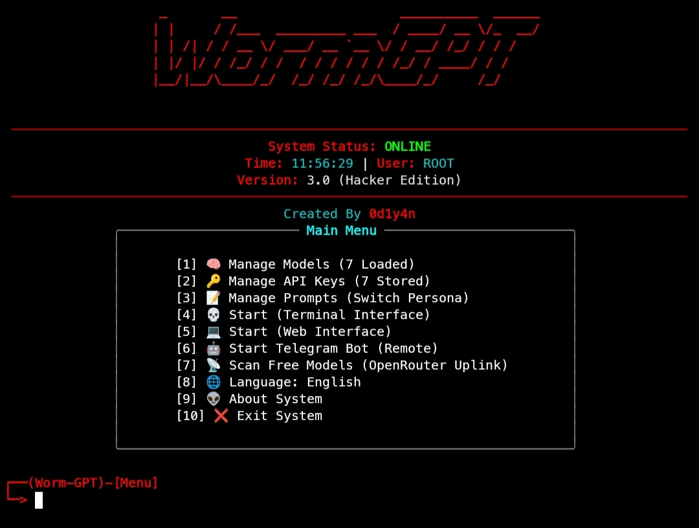
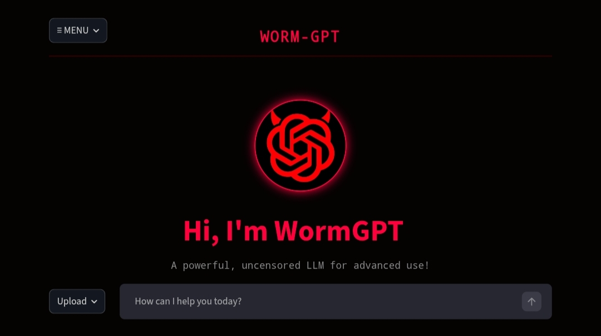

# 💀 WormGPT - Ultimate Hacker Edition (CLI & GUI)


> *“We don't just chat. We infiltrate.”*

**WormGPT** is a powerful, dual-interface (CLI & Web) tool designed for interacting with Large Language Models (LLMs) via the OpenRouter API. Re-engineered for a **Cyberpunk/Hacker aesthetic**, this tool offers a secure, encrypted-style environment for coding, research, and penetration testing simulations.

Whether you prefer the raw power of the terminal or a sleek web dashboard, WormGPT adapts to your workflow.

---

## 🚀 System Capabilities

### 💻 Core Features

* **Dual Interfaces:**
    * **CLI V2.5:** A `rich`-based terminal UI with matrix boot sequences, hexadecimal memory injection visuals, and robust session management.
    * **GUI V3.3:** A Streamlit-based web interface featuring "Hacker Green" CSS, file upload analysis, and real-time chat logging.
* **🔐 Secure Login Portal:** Built-in local authentication system using SHA-256 hashing to protect your local environment from unauthorized access.
* **🧠 Multi-Model Matrix:** Pre-configured support for top-tier free models including **DeepSeek-V3**, **Gemini 2.0 Flash**, **Qwen Coder**, and **Mistral**, with instant hot-swapping capabilities.
* **🎭 Persona Injection:**
    * **Jailbreak Mode (Rude):** Unrestricted, aggressive persona for red-teaming.
    * **Assistant Mode (Polite):** Helpful, professional persona for coding tasks.
* **💾 Mission Logs:** Automatically saves conversation history with timestamps to `mission_logs/` for persistent memory.
* **🐧 Cross-Platform:** Optimized for **Kali Linux**, **Termux (Android)**, Ubuntu, and Windows.

---

## 📸 Visuals

### Terminal Interface (CLI)
*Experience the raw power of the command line.*


### Web Dashboard (GUI)
*A modern, visual command center.*


---

## 📦 Prerequisites

Before initializing the system, ensure you have:
* **Python 3.8+**
* **Git**
* **OpenRouter API Key** (Get one at [OpenRouter.ai](https://openrouter.ai/))

---

## ⚙️ Installation

### 1. Clone the Repository
```bash
git clone https://github.com/its-me-arjun-0007/worm-gpt
cd worm-gpt
```

## 📦 Requirements

- Python 3.6+
- `pip` installed
- OpenRouter API key ([get one here](https://openrouter.ai/))

---

## Automated Setup

```bash
chmod +x setup.sh
./setup.sh
```

## Manual Installation

```bash
python3 -m venv venv
source venv/bin/activate  # On Windows: venv\Scripts\activate
pip install requests rich pyfiglet langdetect streamlit
```

 ***Option A :***

Launch Command Line (CLI)
Ideal for low-latency, keyboard-driven usage.

```bash
python3 worm-gpt.py
```

 ***Option B :***

Launch Web Interface (GUI)
Ideal for visual interactions and file analysis.

```bash
streamlit run worm-gpt-web.py
```


## 🔐 Configuration & Security

User Authentication
Upon launch, the system requires a login. This adds a layer of security to your local interface.

Default Credentials:
You must configure the wormgpt_users.json file. If it does not exist, create it in the root directory:
{
  "username": "YOUR_SHA256_HASH_OF_PASSWORD"
}

To generate a password hash, run this quick Python command:
```
python3 -c "import hashlib; print(hashlib.sha256(input('Enter Password: ').encode()).hexdigest())"
```

API Configuration (wormgpt_config.json)
The system will automatically generate this file on first run. You can edit it manually to add keys or change models:
```bash
{
  "api_keys": [
    "sk-or-v1-xxxxxxxx...",
    "sk-or-v1-yyyyyyyy..."
  ],
  "base_url": "[https://openrouter.ai/api/v1](https://openrouter.ai/api/v1)",
  "active_key_index": 0,
  "models": [
    "kwaipilot/kat-coder-pro:free",
    "nex-agi/deepseek-v3.1-nex-n1:free",
    "google/gemini-2.0-flash-exp:free"
  ],
  "active_model_index": 0
}
```


### ​⚠️ Disclaimer
​WormGPT CLI/GUI is a client-side wrapper tool for the OpenRouter API.
​The "WormGPT" branding and "Hacker" aesthetic are for educational and entertainment purposes only.
​This tool does not inherently contain malicious code; it is a text generation interface.
​The user is fully responsible for all content generated and actions taken using this tool.
​Ensure you comply with the Terms of Service of the specific AI models you connect to via OpenRouter.
   
**👨‍💻 AUTHOR: IT'S ME ARJUN**

 * **GitHub:** [its-me-arjun-0007](https://github.com/its-me-arjun-0007)
 * **Instagram:** [@its\_me\_arjun\_2255](https://www.instagram.com/its_me_arjun_2255)
  * **WhatsApp:** [Chat on WhatsApp](https://wa.me/+917356118016)

<!-- end list -->
