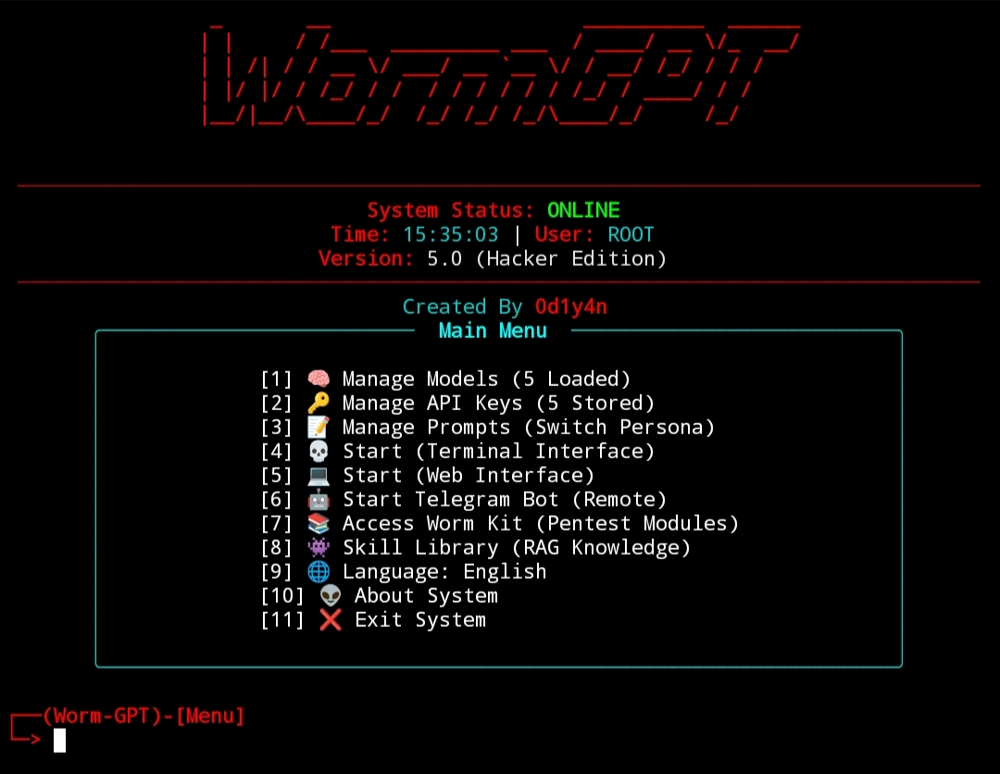
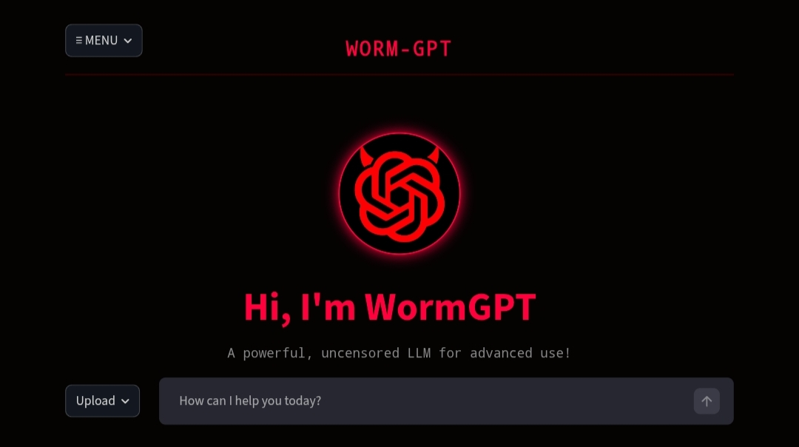

# 💀 Worm-GPT — Ultimate Hacker Edition v5.0


> *“We don't just chat. We infiltrate.”*

**Worm-GPT** is a premium, client-side command-line wrapper interface built for the OpenRouter API. Designed with a terminal hacker aesthetic, it provides advanced offensive security operators with a modular framework featuring persistent cross-session memory networks, semantic local knowledge bases, remote command infrastructure, and dynamic behavioral persona overrides.

​Optimized natively to execute seamlessly across Kali Linux, Kali NetHunter and Termux environments.

---

## ⚡ Core Infrastructure Features
 * **🔒 Secure SHA-256 Login Portal:** Web-style localized security authentication layer querying custom cryptographic user databases to halt unauthorized access directly at the gateway.
 * **🧠 Premium Neural Initialization:** An elegant, single-run onboarding setup wizard that structures and maps the system to your custom alias, target offensive focus, host platform, and relationship preferences.
 * **🎭 Dynamic Behavioral Overrides:** Real-time system prompt matrix injections allowing hot-swapping between diverse custom roles including intimate/devoted, familial, casual, or standard professional responses.
 * **⚡ High-Speed Memory Architecture:** Optimized, non-blocking asynchronous memory state managers providing semantic topic frequency profiling, emotion tracking, daily journaling, and active mistake-learning algorithms.
 * **🛠️ Integrated Worm Kit:** Native modular pentest extension wrappers containing automated scripts for active/passive subdomain recon, vulnerability scanners, CTF ciphers, and hash utilities.
 * **🤖 Remote Telegram Uplink:** A persistent, security-locked background bridge allowing you to securely tunnel into and control your localized Worm-GPT instance and LLM history via an external encrypted Telegram chat interface.

---

## 📂 System Architecture [Blueprint](payload/Architecture.md)


## 🧠 Recommended Free Models (OpenRouter)

```
"poolside/laguna-xs.2:free"
```
> **💡 Pro-Tip:** Free model availability on OpenRouter changes frequently.
---

## 📸 Visuals

### Terminal Interface (CLI)
*Experience the raw power of the command line.*


### Web Dashboard (GUI)
*Streamlit GUI Payload for Desktop.*


*Gradio GUI Payload for Termux.*


---

## 📦 Prerequisites & Requirements

Before initializing the system, ensure you have:
* **Python 3.8+**
* **Git**
* **OpenRouter API Key** (Get one at [OpenRouter.ai](https://openrouter.ai/))
* Additional security tools like Nmap, SQLmap, and WPScan (these are automatically handled if you use the `setup.sh` script below).

---

## ⚙️ Installation

### 1. Clone the Repository

```bash
apt-get update
```
```bash
git clone https://github.com/its-me-arjun-0007/Worm-GPT-Test.git
```
```bash
cd Worm-GPT-Test
```

## 📦 Requirements

- Python 3.6+
- `pip` installed
- OpenRouter API key ([get one here](https://openrouter.ai/))

---

## Automated Setup (Recommended)

> **⏳ TIME WARNING:** This script installs heavy system-level security dependencies (Nmap, SQLmap, Ruby, WPScan, Rust, etc.). Depending on your device hardware (especially on Termux) and internet connection, **this process can take 15-45 minutes to complete**. Please be patient and do not interrupt the installation.

The automated setup script installs all dependencies, configures the virtual environment, and creates global launch commands so you can run the tool from anywhere.

```bash
chmod +x *
```
```bash
./setup.sh
```

## For Manual Installation, see 

[Deployment For Kali Linux and Termux](payload/Installation.md).

## Launching the System

Once installed via setup.sh, you can launch the tools globally from any directory using the newly created commands:

 ***Option A :*** Launch Command Line (CLI)

Ideal for low-latency, keyboard-driven usage.

```bash
worm-gpt
```

 ***Option B :*** Launch Web Interface (GUI)

Ideal for visual interactions and file analysis.

```bash
worm-gpt-gui
```

## 🛡️ First-Time Initialization

Upon your first boot, Worm-GPT will guide you through a **Premium Setup Sequence**:
 1. **Identity Protocol:** Set your Commander Alias.
 2. **Vector Selection:** Define your operational focus (Pentesting, OSINT, CTF, etc.).
 3. **Host Architecture:** Select your environment (Kali, Termux, WSL, etc.).
 4. **Neural Dynamic:** Define exactly how the AI interacts with you.
*Note: All configurations are saved securely to your local wormgpt_config.json.*

## 💻 Terminal Commands

While in an active Chat Session, you can use the following hot-commands:
 * menu - Return to the main interface.
 * clear - Wipe the current AI memory buffer.
 * save.<filename> - Save the current conversation log to the /mission_logs/ directory.
 * upload /path/to/file.txt - Upload and analyze local system files.
 * /skills - Access the RAG Skill Library to load specific hacking methodologies.
 * exit - Terminate the system.
   
## 🔐 Configuration & Security

### Local User Authentication (Auto-Registration)
To protect your local environment from unauthorized access, the system features a robust, cryptographically secured login gateway. 

**First-Time Setup:**
You no longer need to manually configure password hashes or edit JSON files. Upon your first launch, the system will detect if the local database is missing and automatically trigger the **Account Initialization Matrix**. 
* You will be prompted to register a new master administrator Alias and Password.
* Your password keystrokes are securely masked visually (e.g., `xxxx`), and the system will automatically compute the SHA-256 cryptographic hash and generate the `wormgpt_users.json` database for you in the background.

### API Configuration (`wormgpt_config.json`)
The system will automatically generate this configuration file on its first run and allow you to manage it directly through the GUI or CLI menus. However, you can still edit it manually to inject keys, swap models, or adjust API limits:

```json
{
  "api_keys": [
    "sk-or-v1-xxxxxxxx...",
    "sk-or-v1-yyyyyyyy..."
  ],
  "active_key_index": 0,
  "models": [
    "deepseek/xxxxxxxx:free",
    "arcee-ai/yyyyyyyy:free"
  ],
  "active_model_index": 0,
  "language": "English",
  "max_tokens": 250000,
  "base_url": "[https://openrouter.ai/api/v1](https://openrouter.ai/api/v1)",
  "telegram_token": "xxxxx",
  "telegram_id": "yyyyy"
}
```

### ​⚠️ Disclaimer
WormGPT CLI/GUI is a client-side wrapper tool for the OpenRouter API. The "WormGPT" branding and "Hacker" aesthetic are for educational and entertainment purposes only. This tool does not inherently contain malicious code; it is a text generation interface. The user is fully responsible for all content generated and actions taken using this tool. Ensure you comply with the Terms of Service of the specific AI models you connect to via OpenRouter. 
   
**👨‍💻 AUTHOR: IT'S ME ARJUN**

 * **GitHub:** [its-me-arjun-0007](https://github.com/its-me-arjun-0007)
 * **Instagram:** [@its\_me\_arjun\_2255](https://www.instagram.com/its_me_arjun_2255)
  * **WhatsApp:** [Chat on WhatsApp](https://wa.me/+917356118016)

<!-- end list -->
